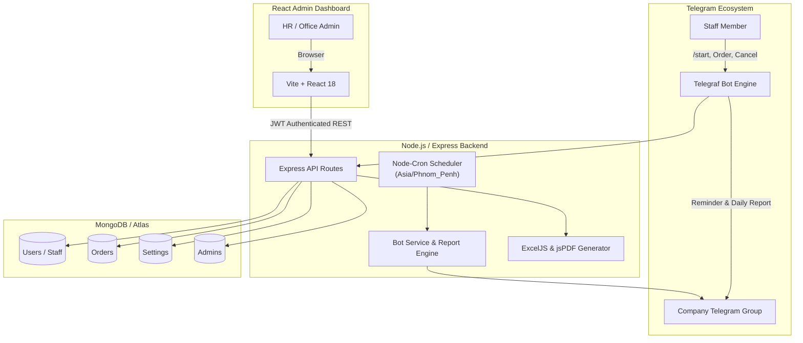

# 🍱 Staff Lunch Order System

[](https://nodejs.org/)
[](https://expressjs.com/)
[](https://react.dev/)
[](https://vitejs.dev/)
[](https://www.mongodb.com/)
[](https://tailwindcss.com/)
[](https://telegram.org/)
[](https://opensource.org/licenses/MIT)

A comprehensive corporate meal tracking solution featuring an **automated Telegram Bot** for daily staff ordering and a **modern React Web Admin Dashboard** for real-time order monitoring, multi-branch reporting, manual staff ordering, and report exports.

---

## 📌 Table of Contents

- [Overview](#-overview)
- [Key Features](#-key-features)
  - [Telegram Bot](#-telegram-bot)
  - [Admin Web Dashboard](#-admin-web-dashboard)
- [System Architecture](#-system-architecture)
- [Tech Stack](#-tech-stack)
- [Project Structure](#-project-structure)
- [Environment Variables](#-environment-variables)
- [Getting Started](#-getting-started)
  - [Prerequisites](#prerequisites)
  - [1. Backend Setup](#1-backend-setup)
  - [2. Database Seeding](#2-database-seeding)
  - [3. Frontend Setup](#3-frontend-setup)
- [Telegram Bot Workflow & Commands](#-telegram-bot-workflow--commands)
- [API Reference](#-api-reference)
- [Deployment Guide](#-deployment-guide)
  - [Option A: Vercel Deployment](#option-a-vercel-deployment)
  - [Option B: Ubuntu VPS with PM2 and Nginx](#option-b-ubuntu-vps-with-pm2-and-nginx)
- [License](#-license)

---

## 🌟 Overview

The **Staff Lunch Order System** streamlines lunch orders across multiple corporate branch locations:
- **BYD 6A**
- **City Mall**
- **BYD 60M**

It operates according to Cambodia Standard Time (`Asia/Phnom_Penh`, UTC+7) and eliminates ordering errors by automatically locking order windows, syncing Telegram chat permissions, notifying teams in real-time, and generating automated daily branch order breakdowns.

---

## 🚀 Key Features

### 🤖 Telegram Bot
- **Interactive Branch Registration**: New staff register instantly via inline buttons upon typing `/start`.
- **Text-Format Ordering & Cancellation**: Strict regex validation for Cambodian ordering templates with status emoji tags (`✅` / `❌`).
- **Configurable Cutoff Window**: Enforces order submission windows (default: `07:00` to `16:00`). Orders outside this window are automatically rejected.
- **Smart Group Chat Permission Sync**: Automatically mutes the Telegram group chat when ordering is closed to reduce clutter, and unmutes when ordering opens.
- **Automated Order Reminders**: Dispatches an automatic notification to the team group when the order window opens.
- **Automated Daily Reports**: Generates and posts the tomorrow's lunch order report grouped by branch to the designated Telegram group at `16:20` daily.
- **Duplicate & Past Date Protection**: Prevents duplicate submissions and forbids cancelling past-dated orders.
- **On-Demand Commands**:
  - `/start` - Register branch and view order instructions.
  - `/report` - Instantly generates and sends the latest lunch breakdown.
  - `/chatid` - Inspect current Telegram Chat/Group ID.

### 💻 Admin Web Dashboard
- **Executive Analytics**: Real-time KPI summary (Total Staff, Tomorrow's Orders, Cancellations, Pending) paired with interactive Recharts order trend visualization.
- **Staff Management**: Full CRUD operations (Add, Edit, Delete) with branch assignments and Telegram ID linking.
- **Manual Order Placement**: Admins can place, cancel, or clear lunch orders directly on behalf of any staff member.
- **Instant Telegram Sync**: Manual actions from the web dashboard immediately dispatch live confirmation (`✅`) or cancellation (`❌`) alerts to the Telegram group.
- **Advanced Multi-Period Reports**:
  - Filter by date range: **Daily**, **Weekly summary**, **Monthly matrix** (staff vs calendar days), or **Custom range**.
  - Filter by branch or search by staff name / username.
  - Export reports to styled **Excel (`.xlsx`)** spreadsheets (ExcelJS) and professional **PDF (`.pdf`)** tables (jsPDF + AutoTable).
- **Live System Settings**: Modify Bot Token, Telegram Group ID, Order Opening Time, Cutoff Time, and Report Dispatch Time on-the-fly without restarting server processes.

---

## 🏗️ System Architecture



---

## 🛠️ Tech Stack

| Layer | Technologies |
|---|---|
| **Backend** | Node.js, Express.js, Telegraf, Mongoose, node-cron, bcryptjs, jsonwebtoken, morgan |
| **Document Export** | ExcelJS (`.xlsx`), jsPDF & jsPDF-AutoTable (`.pdf`) |
| **Frontend** | React 18, Vite, React Router 6, Tailwind CSS, FlyonUI, Framer Motion, Recharts, Lucide Icons, React Hot Toast |
| **Database** | MongoDB (Local or MongoDB Atlas) |
| **Timezone** | `Asia/Phnom_Penh` (Cambodia UTC+7) |
| **Deployment** | Vercel (Configured via `vercel.json`) or Linux VPS (PM2 + Nginx) |

---

## 📁 Project Structure

```text
Order_Lunch/
├── README.md
├── backend/
│   ├── .env.example              # Backend environment template
│   ├── package.json              # Backend dependencies & scripts
│   ├── vercel.json               # Vercel serverless configuration
│   ├── test-integration.js       # API and Telegram notification integration tests
│   ├── test-telegram-bot.js      # Bot handler and command verification test
│   └── src/
│       ├── app.js                # Express app initialization, CORS, DB & bot bootstrap
│       ├── controllers/          # auth, dashboard, report, settings, staff controllers
│       ├── database/
│       │   ├── db.js             # Mongoose MongoDB connection
│       │   └── seed.js           # Database seeder (admin, sample staff & order history)
│       ├── middleware/           # JWT auth middleware, error handlers
│       ├── models/               # Admin, Order, Setting, User Mongoose models
│       ├── routes/               # API route definitions
│       ├── services/
│       │   └── botService.js     # Telegraf bot, cron jobs, Telegram group synchronization
│       └── utils/                # Date utilities, constants, asyncHandler
└── frontend/
    ├── .env.example              # Frontend environment template
    ├── package.json              # Frontend dependencies & scripts
    ├── vite.config.js            # Vite build configuration & API reverse proxy
    ├── tailwind.config.js        # Tailwind CSS and FlyonUI configuration
    ├── vercel.json               # Vercel frontend routing & rewrites
    └── src/
        ├── App.jsx               # Route tree and layout management
        ├── main.jsx              # React entry point
        ├── components/           # Reusable UI components (SearchSelect, PageTransition)
        ├── context/              # AuthContext (JWT management & session state)
        ├── layouts/              # Dashboard layout, sidebar navigation, theme switcher
        ├── pages/
        │   ├── Dashboard.jsx     # Order metrics & Recharts trends
        │   ├── Login.jsx         # Admin authentication
        │   ├── ManualOrder.jsx   # Staff manual order placement with Telegram alerts
        │   ├── Reports.jsx       # Multi-period reports, search, Excel/PDF exports
        │   ├── Settings.jsx      # Bot tokens, group ID, and order schedule configuration
        │   └── StaffManagement.jsx # Staff directory CRUD
        └── utils/                # Axios instance with interceptors, cx helper
```

---

## ⚙️ Environment Variables

### Backend Configuration (`backend/.env`)

Copy `backend/.env.example` to `backend/.env`:

```bash
cp backend/.env.example backend/.env
```

| Variable | Description | Example / Default |
|---|---|---|
| `PORT` | Backend server port | `5002` |
| `NODE_ENV` | Environment mode (`development` / `production`) | `development` |
| `MONGO_URI` | MongoDB connection string | `mongodb://localhost:27017/lunch_order_db` |
| `JWT_SECRET` | Secret key for signing JWT tokens | `your_secure_random_jwt_secret` |
| `JWT_EXPIRES_IN` | JWT token validity | `7d` |
| `BOT_TOKEN` | Telegram Bot token obtained from [@BotFather](https://t.me/BotFather) | `123456789:ABCdefGhIJKlmNoPQRsTUVwxyZ` |
| `TELEGRAM_GROUP_ID` | Telegram Group ID where reports and notifications go | `-1001234567890` |
| `TIME_ZONE` | Standard timezone for cron jobs and order dates | `Asia/Phnom_Penh` |
| `ADMIN_USERNAME` | Default seeded admin username | `admin` |
| `ADMIN_PASSWORD` | Default seeded admin password | `admin123` |
| `FRONTEND_URL` | Allowed CORS origin for production frontend | `https://your-frontend.vercel.app` |

> [!NOTE]
> If `BOT_TOKEN` or `TELEGRAM_GROUP_ID` are left blank in `.env`, you can also configure them directly from the web dashboard in **Settings**.

### Frontend Configuration (`frontend/.env`)

Copy `frontend/.env.example` to `frontend/.env`:

```bash
cp frontend/.env.example frontend/.env
```

| Variable | Description | Example |
|---|---|---|
| `VITE_API_URL` | Base URL of the backend API (leave empty in local development to use the Vite dev proxy) | `https://your-backend.vercel.app` |

---

## 🏁 Getting Started

### Prerequisites
- **Node.js**: v18.x or v20.x+
- **npm**: v9.x+
- **MongoDB**: Local MongoDB instance or free [MongoDB Atlas](https://www.mongodb.com/cloud/atlas) cluster
- **Telegram Bot Token**: Created via [@BotFather](https://t.me/BotFather)

---

### 1. Backend Setup

1. Open your terminal and navigate to the backend folder:
   ```bash
   cd backend
   ```

2. Install dependencies:
   ```bash
   npm install
   ```

3. Create and configure your environment file:
   ```bash
   cp .env.example .env
   ```

4. Start the backend in development mode:
   ```bash
   npm run dev
   ```
   The backend starts at `http://localhost:5002`. On first launch, it connects to MongoDB, auto-seeds the default settings, and seeds the initial admin account.

---

### 2. Database Seeding (Optional but Recommended)

To populate your database with initial mock staff across all 3 branches (`City Mall`, `BYD 6A`, `BYD 60M`) along with 14 days of realistic order history:

```bash
npm run db:seed
```

> [!TIP]
> **Default Admin Credentials**:
> - **Username**: `admin`
> - **Password**: `admin123`

---

### 3. Frontend Setup

1. Open a new terminal window and navigate to the frontend folder:
   ```bash
   cd frontend
   ```

2. Install frontend dependencies:
   ```bash
   npm install
   ```

3. Start the Vite development server:
   ```bash
   npm run dev
   ```

4. Open your browser and navigate to `http://localhost:5173`.
5. Log in with your admin credentials (`admin` / `admin123`).

---

## 📱 Telegram Bot Workflow & Commands

### 1. Getting your Group Chat ID
1. Add your bot to your company lunch Telegram group.
2. Grant the bot **Administrator** privileges (required for group mute/permission synchronization).
3. Type `/chatid` in the group. The bot will respond with the Chat ID (e.g. `-100xxxxxxxxxx`).
4. Paste this ID into `backend/.env` as `TELEGRAM_GROUP_ID` or save it in the Web Admin **Settings**.

### 2. Staff Registration
1. Staff member sends `/start` to the bot in private or in the group.
2. An inline keyboard appears offering branch options:
   - `[ City Mall ]`
   - `[ BYD 6A ]`
   - `[ BYD 60M ]`
3. Clicking an option registers the staff's Telegram ID, name, and branch.

### 3. Placing an Order
Staff post the following template into the Telegram group:

```text
- Name : Chao Vireak
- Brand : BYD6A
- Order on 07-10-2026 ✅
```

### 4. Cancelling an Order
```text
- Name : Chao Vireak
- Brand : BYD6A
- Cancel on 07-10-2026 ❌
```

### 5. Bot Commands List

| Command | Scope | Description |
|---|---|---|
| `/start` | Private / Group | Initializes onboarding, branch registration buttons, and template instructions |
| `/report` | Group / Private | Immediately generates tomorrow's lunch order breakdown report |
| `/chatid` | Group / Private | Returns the chat ID of the current conversation |

---

## 📡 API Reference

All protected endpoints require an `Authorization: Bearer <JWT>` header.

### Authentication (`/api/auth`)
- `POST /api/auth/login` - Authenticate admin with username & password.
- `GET /api/auth/me` - Validate active admin session.

### Staff Management (`/api/staff`)
- `GET /api/staff` - Retrieve all registered staff members.
- `POST /api/staff` - Add a new staff member manually.
- `PUT /api/staff/:id` - Update staff member details or branch.
- `DELETE /api/staff/:id` - Remove staff member from database.

### Reports & Ordering (`/api/reports`)
- `GET /api/reports` - Fetch report data with query params (`period`, `branch`, `date`, `month`, `startDate`, `endDate`).
- `POST /api/reports/manual-order` - Admin manually upserts an order (`ordered`, `cancelled`, `not_ordered`) and triggers a Telegram notification.
- `GET /api/reports/export/excel` - Download report in Excel format (`.xlsx`).
- `GET /api/reports/export/pdf` - Download report in PDF format (`.pdf`).

### Dashboard Analytics (`/api/dashboard`)
- `GET /api/dashboard/stats` - Summary KPI metrics for the next lunch date.
- `GET /api/dashboard/charts` - Historical order volume data for Recharts chart.

### System Settings (`/api/settings`)
- `GET /api/settings` - Retrieve current system and bot configurations.
- `POST /api/settings` - Update bot token, group ID, order start/end times, and report time. Restarts bot dynamically.

---

## 🚀 Deployment Guide

### Option A: Vercel Deployment

Both `backend` and `frontend` contain pre-configured `vercel.json` files for seamless deployment on Vercel.

#### 1. Backend on Vercel
1. In Vercel, import the repository and set the **Root Directory** to `backend`.
2. In the project settings, configure the following Environment Variables:
   - `MONGO_URI` (Your MongoDB Atlas connection string)
   - `JWT_SECRET`
   - `BOT_TOKEN`
   - `TELEGRAM_GROUP_ID`
   - `TIME_ZONE` (`Asia/Phnom_Penh`)
   - `ADMIN_USERNAME`
   - `ADMIN_PASSWORD`
   - `FRONTEND_URL` (Your Vercel frontend URL)
3. Deploy the backend and copy its deployment URL (e.g., `https://lunch-backend.vercel.app`).

#### 2. Frontend on Vercel
1. Import the same repository as a new Vercel project, and set the **Root Directory** to `frontend`.
2. Add the environment variable:
   - `VITE_API_URL` = `https://lunch-backend.vercel.app` (your backend URL)
3. Deploy the frontend.

---

### Option B: Ubuntu VPS with PM2 and Nginx

#### 1. Setup Node.js & PM2
```bash
# Install Node.js via NVM
curl -o- https://raw.githubusercontent.com/nvm-sh/nvm/v0.39.7/install.sh | bash
source ~/.bashrc
nvm install 20
nvm use 20

# Install PM2 globally
npm install -g pm2
```

#### 2. Build Frontend & Launch Backend
```bash
# Clone the repository
git clone https://github.com/Phanit009/Order_Lunch.git
cd Order_Lunch

# Setup Backend
cd backend
npm install --production
cp .env.example .env
# Edit .env with nano or vim
nano .env

# Run backend with PM2
pm2 start src/app.js --name "lunch-backend"
pm2 save
pm2 startup

# Build Frontend
cd ../frontend
npm install
# Set VITE_API_URL or leave empty if using Nginx reverse proxy
npm run build
```

#### 3. Nginx Reverse Proxy Configuration
Create an Nginx server block (`/etc/nginx/sites-available/lunch.conf`):

```nginx
server {
    listen 80;
    server_name lunch.yourcompany.com;

    # Serve built React frontend
    location / {
        root /var/www/Order_Lunch/frontend/dist;
        index index.html index.htm;
        try_files $uri $uri/ /index.html;
    }

    # Proxy API requests to Node.js backend
    location /api/ {
        proxy_pass http://localhost:5002;
        proxy_http_version 1.1;
        proxy_set_header Upgrade $http_upgrade;
        proxy_set_header Connection 'upgrade';
        proxy_set_header Host $host;
        proxy_cache_bypass $http_upgrade;
        proxy_set_header X-Real-IP $remote_addr;
        proxy_set_header X-Forwarded-For $proxy_add_x_forwarded_for;
        proxy_set_header X-Forwarded-Proto $scheme;
    }
}
```

Enable the site and reload Nginx:
```bash
sudo ln -s /etc/nginx/sites-available/lunch.conf /etc/nginx/sites-enabled/
sudo nginx -t
sudo systemctl reload nginx
```

#### 4. Enable SSL with Let's Encrypt
```bash
sudo apt install certbot python3-certbot-nginx -y
sudo certbot --nginx -d lunch.yourcompany.com
```

---

## 📄 License

This project is licensed under the [MIT License](LICENSE).
